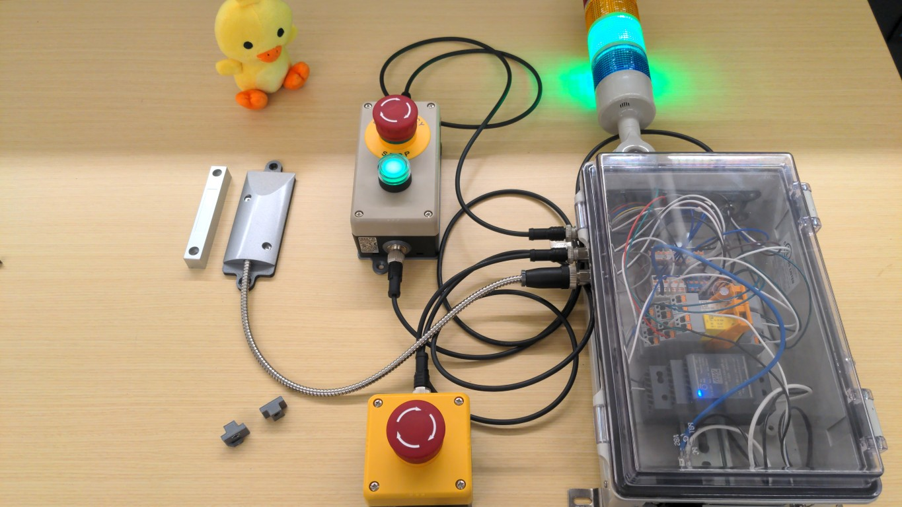
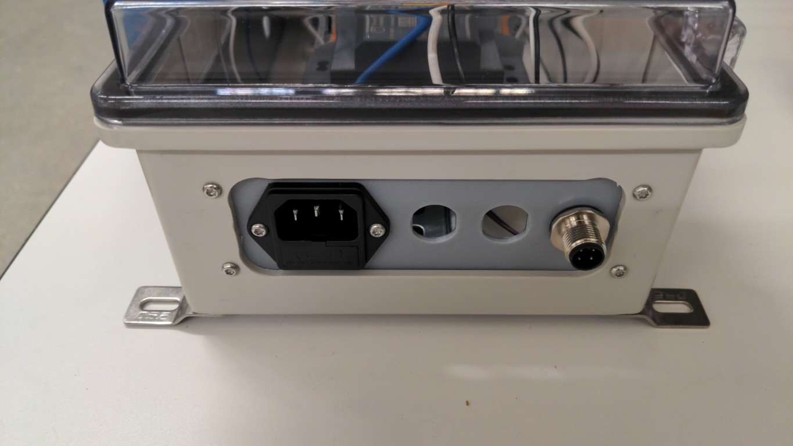
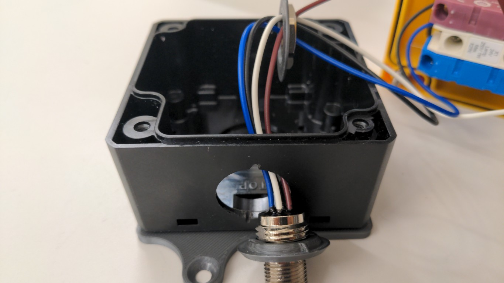

# interlock-controller

## ⚠️ DISCLAIMER ⚠️

This design is provided for reference and development purposes only.
It is not certified, not validated, and not intended for use as a safety‑critical control system without independent verification, validation, and certification by the user.
Enphase makes no representations regarding fitness for safety‑related use, including protection of persons, property, or equipment.

Any use of this design in systems that may cause harm, injury, or damage is solely at the user’s risk.
Users are responsible for compliance with applicable safety standards, regulations, and certifications.

## Introduction

This is a design for a controller box for an interlock system, including interface definitions, mechanical designs and wiring diagrams.
Broadly, it takes in inputs (like E-stops, magnetic sensors, and a start button) and provides outputs (closing an external dry contact loop) and a status light.
The design makes heavy use of 3d printing to be modular and allow iteration and design changes.

## General Design Rules

- Uses metric fasteners (M3 and M4 screws and nuts, both countersunk and pan head).
- 3d printed parts use friction-fit hex nuts.
- Uses 4-pin M12 connectors for sensors and outputs.
- Attaches to T-slot ("8020") framing, using M4 screws.

 
## Design Documents

[design.md](design.md) has detailed interface specifications.

## Mechanical Designs

Parts are designed in either Cadquery (a Python library for defining programmatic 3d designs) or FreeCAD.

Generated STLs are not committed to the repository, these can be generated by either running the CadQuery (`.py`) scripts or exporting from FreeCAD.
STLs MAY be included in the releases.

We have printed our parts on a Prusa XL using a high-flow 0.4mm nozzle and set for 0.2mm STRUCTURAL or 0.2mm BREAKAWAY INTERFACE, with PETG material (and PLA breakaway where needed).
These are expected to work on most FDM printers.
Unless otherwise noted, most parts can be printed in an orientation that does not require support. 

### T-slot Nuts

[tslot_nut.py](tslot_nut.py) generates a parametric T-slot nut with a hex nut pocket and spring arm to hold its position.
Print in PETG for flexibility of the spring arm.
You may need to tune parameters.

These are parameterized for 4545 metric T-slot framing.

### Controller Box and Connector Panels

The main controller box is a COTS box (NBB-10261) with machined cutouts (rounded rectangle + 4 M3 mounting holes) for 3d printed panels to fit connectors.
These can be purchased as a modified enclosure from Bud (with additional lead-time and $450 minimum order), through one of their distributors.
Alternatively, these can be machined (**not easily! needs special fixturing!**) on a manual mill and a 3/4" or 20mm end mill.

Previously, this was two 116x40mm R10mm slots (top and bottom) and a 216x40mm R10mm slot (side), with M3 holes on a 124x32mm and 224x32mm pattern, respectively.
Newer version will have 116x40mm R10mm slots on three sides, with M3 holes on a 124x32mm pattern.

[connector_plate.py](connector_plate.py) generates the connector plates to fit into the cutouts.
These hold a M3 nut and have connector cutouts for eg, M12 connectors.

Electronics, like relays, are mounted to a DIN rail on the controller box.
The DIN rail is attached to factory-provided M4 threaded inserts / bosses in the box.
[din35_mount_stabilizer.py](din35_mount_stabilizer.py) generates a prismatic standoff that sits below the DIN rail to give it stability.
It can also be used to join two DIN rails back-to-back.
We use three of them: one next to each boss, and one to join two DIN rails; this seems to provide enough stability for DIN-mount spring-actuated terminal blocks.

If you are machining the box yourself, see [manufacturing-notes.md](manufacturing-notes.md).

See [design.md](design.md) for the electronics inside the box.

### Control Boxes

Human interface boxes (like for e-stop and pushbutton switches) use IDEC boxes like FB1W-111Y and FB2W-211Z, which are mounted to the T-slot framing using adapter plates.

These have a 21.3mm punchout, which is too large for M12 connectors.
[idec_fb_m12_adapter.FCStd](idec_fb_m12_adapter.FCStd) and [idec_fb_m12_washer.FCStd](idec_fb_m12_washer.FCStd) "sandwich" the M12 connector to adapt it to the larger punchout.
idec_fb_m12_adapter.FCStd must be printed with supports, preferably two-material breakaway supports.
Because these add thickness, the O-ring on the M12 connectors must be removed.
Additionally, these have an anti-rotation feature, so a 1mm wide x 2mm long (radially outward) slot needs to be dremeled into the top of the punchout.
The anti-rotation feature is triangular, the slot does not have to be completely through.

[adapter_plate.py](adapter_plate.py) generates adapter plates that adapt the back of these boxes to attach to the T-slot framing.
These attach to the back of the IDEC box using M4 countersunk screws.
You will need to tap the factory holes on the box with a M4 tap.
